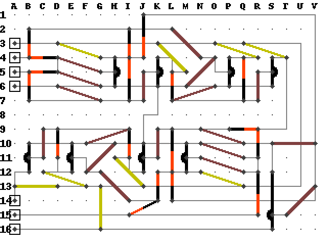
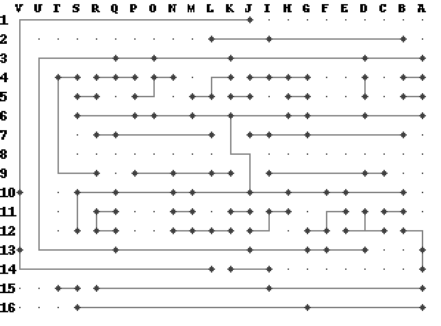

# Circuit drawer
Simple pixel art circuit drawing maker.

It parses simple text files containing lines of the form: `component endpoint+`, where each
endpoint is given as Excel-style coordinate (e.g. C5).

For example:
```
pin A16
wire A3 U3
```
Also see `examples/desc` for more elaborate example. To draw the schematic, type:
```
python3 examples/desc top.png bottom.png
```
Results:





The code is mostly undocumented, with features hacked on when needed. See also `modify.py` to provide
basic editing functionality (translations, rotations, etc.).
